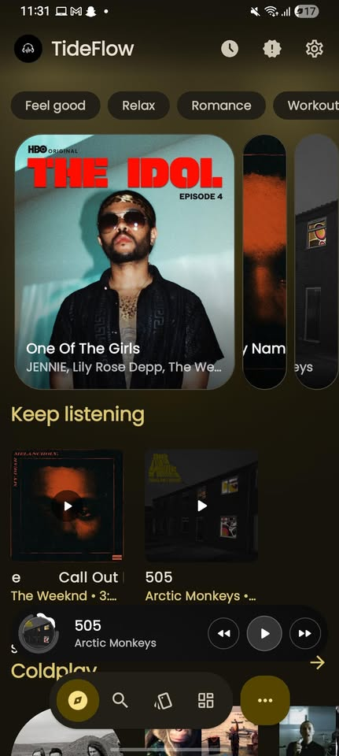
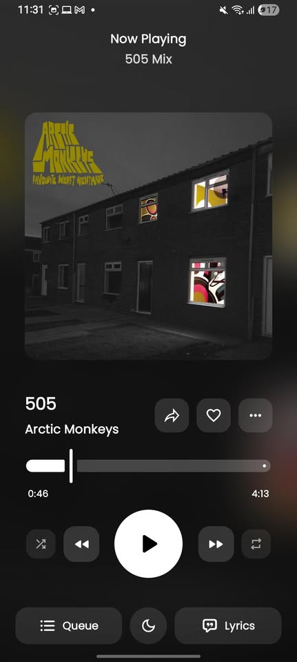
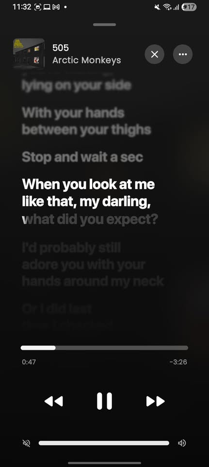
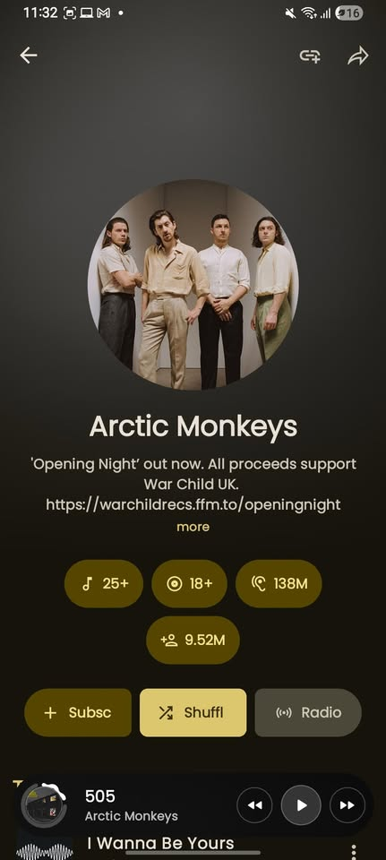
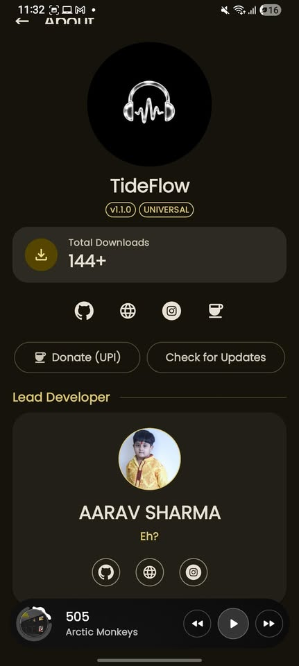

<div align="center">

  

  # TideFlow

  ### Pure Open-Source Android Music Streaming

  **Zero Ads. Zero Tracking. Pure Sound.**

  A modern, elegant, and ad-free Android music player powered by YouTube Music, engineered with Kotlin, Jetpack Compose, Material You dynamic theming, real-time synchronized lyrics, and local offline caching.

  [](https://www.gnu.org/licenses/gpl-3.0)
  [](https://www.android.com)
  [](https://github.com/aaravgaming007-dev/TideFlow/releases)
  [](https://github.com/aaravgaming007-dev/TideFlow/stargazers)
  [](https://github.com/aaravgaming007-dev/TideFlow/releases)

  [**📥 Download Latest APK**](https://github.com/aaravgaming007-dev/TideFlow/releases/latest) • [**🌐 Developer Website**](https://aaravsharma.pages.dev) • [**🐛 Report an Issue**](https://github.com/aaravgaming007-dev/TideFlow/issues)

</div>

---

## 📱 Screenshots

<p align="center">
  
  
  
  
  
</p>

---

## ✨ Features

### 🎧 100% Ad-Free Audio
- Direct YouTube Music streaming pipeline with zero commercial interruptions
- Background playback and lock-screen controls
- Audiophile streaming support: Opus 320 kbps decoding & FLAC support
- Gapless crossfade playback & customizable audio equalizers
- EBU R128 loudness normalization
- Pitch, tempo, and playback speed adjustment

### 🎤 Real-Time Synced Lyrics
- Word-by-word and line-by-line synchronized LRC lyrics
- Multi-provider lyric engines (LRCLIB, BetterLyrics, KuGou, and Paxsenix)
- AI-driven multi-language lyrics translation and romanization
- Interactive lyrics view with click-to-seek playback
- Shareable lyric cards generator

### 🎨 Material You & True Black OLED
- Adaptive Monet dynamic color extraction from album artwork
- True pitch-black AMOLED dark mode for battery savings
- Motion video backdrops and animated canvas art
- Multiple player layouts and responsive UI for phones, foldables, and tablets

### 💾 Local Vault & Offline Downloads
- Instant one-tap offline song caching
- High-speed multithreaded downloads with background pre-fetching
- Local audio library management with metadata editing & tag scanner
- One-click Spotify playlist import

### 🌐 Ecosystem & Integrations
- Real-time Discord Rich Presence (RPC) showing your currently playing track
- Last.fm & ListenBrainz real-time scrobbling
- Shazam-powered music recognition
- YouTube Music account sync and custom playlist cloud backups

---

## 📥 Installation

### 🔽 Direct APK Download
1. Head over to [GitHub Releases](https://github.com/aaravgaming007-dev/TideFlow/releases/latest).
2. Download the latest `universal` APK (or device-specific architecture).
3. Open the downloaded file and install on your device (allow *Install from Unknown Sources* if prompted).

---

## 🛠️ Building from Source

### Prerequisites
- Android Studio Ladybug or newer
- JDK 21
- Android SDK 37 (API 35+ recommended)

### Build Commands
```bash
# Clone the repository
git clone https://github.com/aaravgaming007-dev/TideFlow.git
cd TideFlow

# Assemble universal release APK
./gradlew assembleGmsMobileUniversalRelease
```

---

## 📄 License

This project is licensed under the **GNU General Public License v3.0** — see the [LICENSE](LICENSE) file for details.

---

<div align="center">

  **TideFlow** is engineered with ❤️ by [**Aarav Sharma**](https://github.com/aaravgaming007-dev)  
  [Website](https://aaravsharma.pages.dev) • [Instagram](https://instagram.com/aarav_sharma_sui) • [GitHub](https://github.com/aaravgaming007-dev)

</div>
